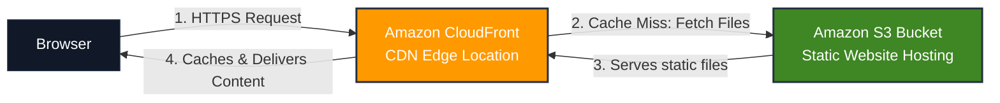

# AWS Student Community — Session 01
## Deploy Your First Website with Amazon S3 & CloudFront

Welcome to the first session of the AWS Student Community workshop series! 🚀

In this hands-on workshop, you will learn how to deploy a static web application on AWS using **Amazon S3** and **Amazon CloudFront**. By the end of this session, you will have a publicly accessible website hosted on a secure global Content Delivery Network (CDN) and understand the core concepts of cloud-based web hosting.

---

## 🎯 Learning Objectives

By the end of this workshop, you will be able to:
* **Understand** the fundamentals of cloud storage and Content Delivery Networks (CDNs).
* **Create & Configure** an Amazon S3 bucket for static website hosting.
* **Understand S3 Bucket Policies** and AWS's secure-by-default philosophy.
* **Deploy a CDN** globally using Amazon CloudFront.
* **Secure your website** with HTTPS and manage edge caching.

---

## 🏗️ Architecture



### Services Used

* **Amazon S3 (Simple Storage Service):** An object storage service built to store and retrieve any amount of data. Here, it acts as the origin hosting our static files (HTML, CSS, JavaScript).
* **Amazon CloudFront:** A fast content delivery network (CDN) service that securely delivers data, videos, applications, and APIs to customers globally with low latency. Here, it caches content closer to users and provides HTTPS.

---

## 📋 Prerequisites

Before starting, ensure you have:
* An **AWS Account** (Free Tier is sufficient).
* A stable **Internet Connection**.
* A modern **Web Browser**.
* Basic familiarity with files (HTML/CSS/JS is helpful but not required).

---

## 📂 Repository Structure

```text
session-101/
│
├── Docuementation/          # Slides and additional documentation (e.g. PDFs)
│
├── quizapp/                 # The Static Web Application files
│   ├── index.html           # Structure & intro screen
│   ├── style.css            # Modern styling & animations
│   └── script.js            # Interactive quiz logic
│
├── LICENSE                  # MIT License
└── README.md                # Workshop guide (this file)
```

---

## 🛠️ Workshop Steps

### Step 1: Sign In to AWS
1. Open the [AWS Management Console](https://aws.amazon.com/console/).
2. Sign in using your AWS Account credentials.
3. In the search bar at the top, type **S3** and select it to open the S3 Dashboard.

---

### Step 2: Create an Amazon S3 Bucket
1. Click the **Create Bucket** button.
2. Configure the following settings:
   * **Bucket Name:** Enter a globally unique name (e.g., `aws-sbg-quiz-[yourname]-[date]`).
   * **AWS Region:** Choose a region close to your target audience (e.g., *Asia Pacific (Mumbai) ap-south-1*).
   * **Object Ownership:** Keep *ACLs disabled (recommended)*.
3. Leave all other settings as their default values.
4. Scroll to the bottom and click **Create Bucket**.

> [!NOTE]
> S3 bucket names must be globally unique across all AWS accounts worldwide. If your chosen name is taken, try appending random numbers or your initials.

---

### Step 3: Upload Website Files
1. In the S3 console, click on the name of your newly created bucket.
2. Click **Upload** or drag and drop the files from your local `quizapp/` directory:
   * `index.html`
   * `style.css`
   * `script.js`
3. Click the **Upload** button at the bottom of the page to complete the transfer.

> [!IMPORTANT]
> Make sure to upload the **contents** of the `quizapp` folder directly, not the `quizapp` folder itself. S3 needs `index.html` to be at the root of the bucket.

---

### Step 4: Configure Static Website Hosting
1. Within your bucket, click on the **Properties** tab.
2. Scroll to the very bottom to find the **Static website hosting** section and click **Edit**.
3. Configure the settings:
   * **Static website hosting:** Select *Enable*.
   * **Hosting type:** Select *Host a static website*.
   * **Index document:** Type `index.html`.
4. Click **Save changes**.

---

### Step 5: Test the Website Endpoint (The 403 Forbidden Moment)
1. Go back to the bottom of the **Properties** tab.
2. Under **Static website hosting**, copy the **Bucket website endpoint** URL.
3. Paste the URL into a new browser window.
4. You should see a **403 Forbidden (Access Denied)** page.

> [!NOTE]
> **Why are we seeing 403 Forbidden?**
> AWS follows a *security-first* approach. By default, S3 blocks all public access to protect your files from unauthorized viewing. Enabling website hosting does not automatically grant public permission to access the files. We must explicitly authorize public read access.

---

### Step 6: Allow Public Read Access
To allow users to view your website, you must unblock public access and apply a bucket policy.

#### Part A: Unblock Public Access
1. Click on the **Permissions** tab of your bucket.
2. Under **Block public access (bucket settings)**, click **Edit**.
3. Uncheck **Block *all* public access**.
4. Click **Save changes** and type `confirm` when prompted.

#### Part B: Add a Bucket Policy
1. Scroll down to the **Bucket policy** section and click **Edit**.
2. Copy and paste the JSON policy below:

```json
{
  "Version": "2012-10-17",
  "Statement": [
    {
      "Sid": "PublicReadGetObject",
      "Effect": "Allow",
      "Principal": "*",
      "Action": "s3:GetObject",
      "Resource": "arn:aws:s3:::YOUR_BUCKET_NAME/*"
    }
  ]
}
```

> [!WARNING]
> You **must** replace `YOUR_BUCKET_NAME` with your actual S3 bucket name. Make sure to keep the `/*` at the end of the resource ARN so it applies to all objects inside the bucket.

3. Click **Save changes**.

---

### Step 7: Verify the S3 Website
1. Refresh the **Bucket website endpoint** URL in your browser.
2. The **Cloud IQ — AWS Quiz** application should now load and function perfectly! 🎉

---

### Step 8: Create a CloudFront Distribution
While S3 is great for storage, serving content globally directly from S3 can be slow for users far from your bucket's region. Let's fix this using CloudFront.

1. Open the AWS Console search bar, type **CloudFront**, and click it to open the CloudFront console.
2. Click **Create Distribution**.
3. Configure the following:
   * **Origin Domain:** Select your S3 bucket endpoint.
     > [!TIP]
     > CloudFront will suggest your S3 bucket (e.g. `your-bucket.s3.amazonaws.com`). For static hosting, it is best to use the S3 Static Website Endpoint URL (copy it from S3 Properties and paste it here without the `http://` protocol).
   * **Viewer Protocol Policy:** Select *Redirect HTTP to HTTPS* (ensures secure connections).
   * **Web Application Firewall (WAF):** Choose *Do not enable security protections* for the purposes of this demo workshop.
4. Scroll to the bottom and click **Create Distribution**.

> [!NOTE]
> Setting up a CloudFront distribution takes about **3–5 minutes** to deploy globally across AWS edge locations. Once deployed, the status will change to **Enabled**.

---

### Step 9: Access Your Site via CDN
1. Locate the **Distribution domain name** on your CloudFront dashboard (e.g., `https://dxxxxxxxxxx.cloudfront.net`).
2. Copy the domain and open it in a browser tab.
3. Verify that your website loads securely over **HTTPS**.

---

## ⚡ Understanding CDN Caching

CloudFront stores copies of your website files at **Edge Locations** around the world. Let's demonstrate how this caching works.

### Caching Demonstration
1. Open `quizapp/index.html` locally and modify a piece of text (e.g., change the subtitle from `5 questions.` to `Test your AWS knowledge.`).
2. Upload the updated `index.html` to S3 (overwriting the old one).
3. Access your site using the **S3 Bucket Endpoint** URL. You will see the update **immediately**.
4. Access your site using the **CloudFront Distribution** URL. The old text will still appear!

### Why does this happen?
CloudFront caches files to avoid fetching them from S3 on every request. By default, it will keep files cached at edge locations for up to 24 hours (or according to TTL settings).

### How to push updates immediately? (Invalidation)
1. Go to your CloudFront distribution settings.
2. Click on the **Invalidations** tab.
3. Click **Create Invalidation**.
4. Type `/*` (to clear the cache for all files) and click **Create Invalidation**.
5. Once the invalidation finishes, refresh your CloudFront URL. The changes will now be visible!

---

## 🔍 Troubleshooting Guide

### ❌ 403 Access Denied
* **Check Public Access:** Make sure "Block *all* public access" is turned **off** in S3 permissions.
* **Check Bucket Policy:** Ensure you replaced `YOUR_BUCKET_NAME` with your exact bucket name in the bucket policy, and that it has `/*` at the end.
* **Check Static Hosting:** Confirm static website hosting is enabled under properties.

### 🔄 Changes Do Not Appear on CloudFront
* **CloudFront Caching:** The CDN caches content. Invalidate the cache by creating a CloudFront invalidation for `/*`.
* **Browser Caching:** Force reload the page using `Ctrl + F5` (Windows) or `Cmd + Shift + R` (Mac), or open it in Incognito/Private mode.

### 📛 "Bucket Name Already Exists" Error
* S3 names are shared globally. Try incorporating a unique suffix like a timestamp, random digits, or your initials.

### 🌐 Website works via S3, but not via CloudFront
* CloudFront may still be deploying. Wait 5-10 minutes.
* Check that you set the correct Origin URL in CloudFront. If you used the S3 REST API endpoint instead of the Website hosting endpoint, index pages might not route correctly.

---

## 🎓 Key Concepts Covered
* **Cloud Storage vs. Server Hosting:** Storing static files vs running active compute engines.
* **Security-by-Default:** Understanding AWS access controls and bucket policies.
* **Content Delivery Network (CDN):** Distributing content globally using Edge Locations.
* **Latency & Caching:** Decreasing request times by serving files from cached edge databases.
* **HTTPS Encryption:** Securing static endpoints using SSL/TLS certificates provided by CloudFront.
---

## 📚 Resources
* [Amazon S3 Documentation](https://docs.aws.amazon.com/s3/)
* [Amazon CloudFront Documentation](https://docs.aws.amazon.com/cloudfront/)
* [AWS Free Tier Overview](https://aws.amazon.com/free/)
* [AWS Student Community Learning Series](https://aws.amazon.com/education/aws-educate/)

---
*Developed for the AWS Student Community Workshop series. Licensed under the MIT License.*
